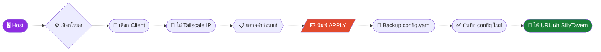
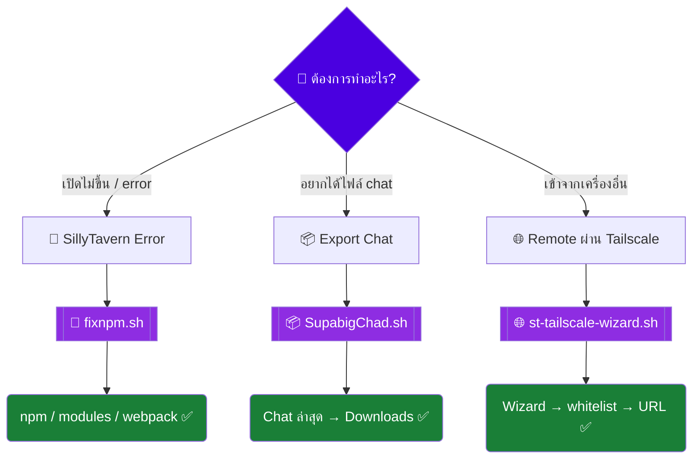

<div align="center">

<!-- ═══════════════ ANIMATED HEADER ═══════════════ -->


<a href="https://github.com/Ze4llaboizeng/my-command">

</a>

<br/>

<!-- ═══════════════ BADGES ═══════════════ -->


<br/><br/>

<!-- ═══════════════ NAV MENU ═══════════════ -->

<a id="menu"></a>

| [🩺 เช็คอาการ](#doctor) | [🚀 Quick Start](#quick-start) | [🛠 เครื่องมือ](#tools) | [🌐 Tailscale Wizard](#tailscale) | [🗺 แผนที่](#map) | [⚠️ ก่อนใช้](#warning) |
|:---:|:---:|:---:|:---:|:---:|:---:|

<sub>💡 กด <kbd>คลิก</kbd> ที่หัวข้อไหนก็ได้เพื่อกระโดดไปตรงนั้นเลย — ทุกกล่อง <kbd>▸</kbd> ในหน้านี้กดกางออกได้หมด</sub>

</div>

> **Repository นี้คืออะไร?** ชุด Utility ส่วนตัวสำหรับจัดการและแก้ปัญหายอดฮิตของ **SillyTavern** โดยเฉพาะบน **Termux** พร้อม Wizard ตั้งค่า Remote Access ผ่าน **Tailscale** — เขียนมาเพื่อไม่ต้องพิมพ์คำสั่งเดิมซ้ำเป็นรอบที่ 47 😤

<br/>

<!-- ═══════════════ SYMPTOM CHECKER ═══════════════ -->

<a id="doctor"></a>

## 🩺 เช็คอาการก่อน — คุณเป็นแบบไหน?

<div align="center"><sub>👇 กดกล่องที่ตรงกับอาการของคุณ แล้วจะได้ "ใบสั่งยา" ทันที 👇</sub></div>
<br/>

<details>
<summary>&nbsp;🔴&nbsp; <b>SillyTavern เปิดไม่ขึ้น / npm พัง / module หาย</b> &nbsp;<sub><i>← กดตรงนี้</i></sub></summary>
<br/>

> ### 💊 ใบสั่งยา: [`fixnpm.sh`](./fixnpm.sh)

**อาการที่เข้าข่าย — มีสักข้อก็ใช้ได้เลย:**

- [x] `ERR_MODULE_NOT_FOUND`
- [x] `npm: command not found` / npm path มีปัญหา
- [x] `node_modules` หายหรือไม่สมบูรณ์
- [x] Webpack compilation / cache error
- [x] `Cannot read properties of undefined`

**วิธีกินยา:**

```bash
bash fixnpm.sh
```

แล้วเลือกเลขตามอาการในเมนู — Script จะวินิจฉัยและแก้ให้เอง 🤖

<div align="right">

[](./fixnpm.sh) &nbsp; [📖 อ่านรายละเอียดเต็ม](#fixnpm)

</div>
</details>

<details>
<summary>&nbsp;📦&nbsp; <b>อยากดึง Chat ล่าสุดออกมาไว้ใน Downloads</b> &nbsp;<sub><i>← กดตรงนี้</i></sub></summary>
<br/>

> ### 💊 ใบสั่งยา: [`SupabigChad.sh`](./SupabigChad.sh)

Script จะสแกนหา Character/Chat folder ที่มี `.jsonl` ให้เลือกจากเมนู แล้วนำไฟล์ **ล่าสุด** ออกไปไว้ที่:

```text
~/storage/downloads/ST-chat-export/
```

**วิธีกินยา:**

```bash
bash SupabigChad.sh
```

> [!WARNING]
> Script นี้ใช้ `mv` ไม่ใช่ `cp` — ไฟล์ chat ล่าสุดจะถูก **ย้ายออกจากโฟลเดอร์เดิม** ไปที่ Downloads เลยนะ!

<div align="right">

[](./SupabigChad.sh) &nbsp; [📖 อ่านรายละเอียดเต็ม](#supabigchad)

</div>
</details>

<details>
<summary>&nbsp;🌐&nbsp; <b>อยากเปิด SillyTavern จากมือถือ / Tablet / PC เครื่องอื่น</b> &nbsp;<sub><i>← กดตรงนี้</i></sub></summary>
<br/>

> ### 💊 ใบสั่งยา: [`st-tailscale-wizard.sh`](./st-tailscale-wizard.sh)

Interactive Wizard ตั้งค่า SillyTavern + Tailscale แบบจับมือทำทีละขั้น รองรับ:

`Android/Termux` · `Windows/Git Bash` · `Windows/WSL` · `Linux` · `macOS`

**วิธีกินยา:**

```bash
bash st-tailscale-wizard.sh
```

หรือระบุโฟลเดอร์ SillyTavern เอง:

```bash
bash st-tailscale-wizard.sh --dir "$HOME/SillyTavern" wizard
```

<div align="right">

[](./st-tailscale-wizard.sh) &nbsp; [📖 อ่านรายละเอียดเต็ม](#tailscale)

</div>
</details>

<details>
<summary>&nbsp;🟢&nbsp; <b>ไม่มีปัญหาอะไร แค่แวะมาดูเฉยๆ</b> &nbsp;<sub><i>← กดตรงนี้</i></sub></summary>
<br/>

โอเค คนไข้สุขภาพดี 💪 งั้นเชิญชม [🗺 แผนที่เลือก Script](#map) หรือกด ⭐ ให้ Repo ก่อนกลับก็ได้นะ

</details>

<br/>

<!-- ═══════════════ QUICK START ═══════════════ -->

<a id="quick-start"></a>

## 🚀 Quick Start

<table>
<tr>
<td width="50%" valign="top">

### 🅰️ ทางเลือกที่ 1 — Clone ทั้ง Repo <sub>(แนะนำ)</sub>

```bash
git clone https://github.com/Ze4llaboizeng/my-command.git
cd my-command
chmod +x fixnpm.sh SupabigChad.sh st-tailscale-wizard.sh
```

แล้วรันตัวที่ต้องการ:

```bash
./fixnpm.sh              # 🔧 ซ่อม npm
./SupabigChad.sh         # 📦 export chat
./st-tailscale-wizard.sh # 🌐 tailscale wizard
```

</td>
<td width="50%" valign="top">

### 🅱️ ทางเลือกที่ 2 — โหลดเฉพาะตัวที่ใช้

<details>
<summary><b>📥 fixnpm.sh</b></summary>

```bash
curl -fsSLO https://raw.githubusercontent.com/Ze4llaboizeng/my-command/main/fixnpm.sh
chmod +x fixnpm.sh && ./fixnpm.sh
```

</details>

<details>
<summary><b>📥 SupabigChad.sh</b></summary>

```bash
curl -fsSLO https://raw.githubusercontent.com/Ze4llaboizeng/my-command/main/SupabigChad.sh
chmod +x SupabigChad.sh && ./SupabigChad.sh
```

</details>

<details>
<summary><b>📥 st-tailscale-wizard.sh</b></summary>

```bash
curl -fsSLO https://raw.githubusercontent.com/Ze4llaboizeng/my-command/main/st-tailscale-wizard.sh
chmod +x st-tailscale-wizard.sh && ./st-tailscale-wizard.sh
```

</details>

</td>
</tr>
</table>

<br/>

<!-- ═══════════════ TOOLS OVERVIEW ═══════════════ -->

<a id="tools"></a>

## 🛠 เครื่องมือทั้งหมดใน Repo

| | Script | ใช้ทำอะไร | Platform |
|:---:|---|---|---|
| 🔧 | [`fixnpm.sh`](./fixnpm.sh) | ตรวจและแก้ npm, `node_modules`, Webpack cache | `Termux` |
| 📦 | [`SupabigChad.sh`](./SupabigChad.sh) | เลือกและย้าย Chat `.jsonl` ล่าสุดไป Downloads | `Termux` |
| 🌐 | [`st-tailscale-wizard.sh`](./st-tailscale-wizard.sh) | ตั้งค่า SillyTavern ให้เข้าผ่าน Tailscale ได้ | `Termux` `Windows` `WSL` `Linux` `macOS` |
| 🪟 | [`StartWithTailscale.bat`](./StartWithTailscale.bat) | เมนู Tailscale สำหรับ Windows CMD | `Windows` |

---

<a id="fixnpm"></a>

<details>
<summary><h3>🔧 <code>fixnpm.sh</code> — หมอประจำตัว SillyTavern บน Termux &nbsp;<sub><i>(กดกางดูรายละเอียด)</i></sub></h3></summary>

<br/>

เปิดมาจะเจอเมนูให้เลือกอาการ:

```text
=======================================
     SillyTavern - Fix Script
=======================================

เลือกปัญหาที่พบ:

[1] ERR_MODULE_NOT_FOUND
[2] npm มีปัญหา / npm path not found
[3] Error webpack compilation error
[0] ออก
```

### 🔍 สิ่งที่ Script ตรวจให้อัตโนมัติ

| เช็ค | รายละเอียด |
|---|---|
| 🩺 npm | npm ใช้งานได้หรือไม่ |
| 🩺 node_modules | มี `~/SillyTavern/node_modules` หรือไม่ |
| 🩺 .bin | มี `node_modules/.bin` ครบหรือไม่ |

### 💉 วิธีรักษาแต่ละอาการ

<details>
<summary><b>ถ้า npm พัง</b></summary>

ติดตั้ง Yarn แล้วใช้ Yarn ลง npm กลับมา:

```bash
pkg install yarn -y
yarn global add npm
```

</details>

<details>
<summary><b>ถ้า node_modules มีปัญหา</b></summary>

ลบของเดิมทิ้งแล้วลงใหม่:

```bash
rm -rf ~/SillyTavern/node_modules
npm install
```

</details>

<details>
<summary><b>ถ้า Webpack cache พัง</b></summary>

ลบ cache:

```text
~/SillyTavern/data/_webpack
```

</details>

หลังแก้เสร็จ Script จะพยายามเปิด SillyTavern ให้เองด้วย `./start.sh` 🎉

> [!NOTE]
> Script อาจ: ติดตั้ง `yarn` · ลง npm ใหม่ · ลบ `node_modules` · รัน `npm install` · ลบ Webpack cache · start SillyTavern อัตโนมัติ — ถ้า installation ของคุณมี custom dependencies แนะนำเปิดอ่านโค้ดก่อนรัน

</details>

---

<a id="supabigchad"></a>

<details>
<summary><h3>📦 <code>SupabigChad.sh</code> — ขนย้าย Chat ล่าสุดแบบ VIP &nbsp;<sub><i>(กดกางดูรายละเอียด)</i></sub></h3></summary>

<br/>

Script จะค้นหาโฟลเดอร์ chats อัตโนมัติจาก:

```text
~/SillyTavern/data/*/chats/
```

แล้วแสดงเฉพาะโฟลเดอร์ที่มีไฟล์ `.jsonl` ให้เลือก:

```text
1) Character-A
   └─ ล่าสุด: 2026-08-12@20h31m.jsonl

2) Character-B
   └─ ล่าสุด: 2026-08-13@01h42m.jsonl

เลือกหมายเลขโฟลเดอร์:
```

เลือกปุ๊บ ไฟล์ล่าสุดจะถูกย้ายไปที่ `~/storage/downloads/ST-chat-export/` โดยเติมชื่อ folder นำหน้ากันชื่อชนกัน:

```text
Character-A__2026-08-12@20h31m.jsonl
```

### 📲 ครั้งแรกบน Termux

ถ้ายังไม่เคยอนุญาต Storage ให้รันก่อน:

```bash
termux-setup-storage
```

> [!CAUTION]
> คำสั่งที่ใช้จริงคือ `mv "$latest" "$destination"` — เป็นการ **ย้าย** ไม่ใช่ Backup!
> อยากให้ต้นฉบับยังอยู่ใน SillyTavern? แก้ `mv` → `cp` ในโค้ดก่อนใช้งาน

</details>

<br/>

<!-- ═══════════════ TAILSCALE WIZARD ═══════════════ -->

<a id="tailscale"></a>

## 🌐 SillyTavern + Tailscale Wizard

<div align="center">


</div>

Wizard ช่วยตั้งค่า `config.yaml` ของ SillyTavern ให้เครื่องอื่นใน Tailnet เข้ามาใช้งานได้ **โดยไม่ต้องเปิด Port Forwarding บน Router**

**Platform ที่รองรับ:** ✅ Android/Termux · ✅ Windows/Git Bash · ✅ Windows/WSL · ✅ Linux · ✅ macOS

### 🎬 เส้นทางของ Wizard



### 🎮 3 โหมดหลัก — เลือกตามสไตล์คุณ

<details open>
<summary>&nbsp;🔒&nbsp; <b>โหมด 1 — ตั้งค่าใหม่แบบปลอดภัย</b> &nbsp;<sub>ระบุเป็นรายเครื่อง</sub></summary>
<br/>

Whitelist จะถูกสร้างใหม่ อนุญาตเฉพาะ:

```text
::1
127.0.0.1
CLIENT_TAILSCALE_IP
```

👍 เหมาะกับคนที่อยากคุมว่า **เครื่องไหนเข้าได้บ้าง** แบบชัดเจน

</details>

<details>
<summary>&nbsp;➕&nbsp; <b>โหมด 2 — เพิ่ม Client</b> &nbsp;<sub>ของเดิมไม่หาย</sub></summary>
<br/>

เก็บ whitelist เดิมไว้ทั้งหมด แล้วเพิ่ม Tailscale IP ของเครื่องใหม่เข้าไป

```text
มีมือถืออยู่แล้ว  ➕  อยากเพิ่ม iPad  ➕  ไม่อยากลบค่าเดิม  =  โหมดนี้แหละ
```

</details>

<details>
<summary>&nbsp;🌍&nbsp; <b>โหมด 3 — อนุญาตทุกเครื่องใน Tailnet</b> &nbsp;<sub>เปิดกว้างสุด</sub></summary>
<br/>

เพิ่ม network ทั้งช่วงของ Tailscale:

```text
100.64.0.0/10
```

> [!WARNING]
> โหมดนี้เปิดกว้างกว่า whitelist รายเครื่องมาก — ใช้เฉพาะ Tailnet ที่คุณ**ไว้ใจสมาชิกและอุปกรณ์ทุกตัว**เท่านั้น

</details>

### 🔐 Safety First

> [!IMPORTANT]
> Wizard จะ **ไม่แตะ `config.yaml` จนกว่า**คุณจะพิมพ์คำว่า <kbd>APPLY</kbd> ยืนยัน
> พิมพ์ไม่ตรง = ยกเลิกทันที ไฟล์เดิมไม่ถูกแก้ และก่อนบันทึกทุกครั้งจะมี **Backup** สร้างไว้ให้เสมอ
> พลาดแล้วอยากย้อน? → `bash st-tailscale-wizard.sh restore`

### ⌨️ Command Cheat Sheet

<details>
<summary><b>📜 กดดูคำสั่งทั้งหมด</b></summary>
<br/>

| คำสั่ง | ทำอะไร |
|---|---|
| `bash st-tailscale-wizard.sh` | เปิด Interactive Wizard |
| `bash st-tailscale-wizard.sh wizard` | เปิด Wizard (ระบุตรงๆ) |
| `bash st-tailscale-wizard.sh status` | ดู config + URL โดยไม่แก้อะไร |
| `bash st-tailscale-wizard.sh start` | เปิด SillyTavern |
| `bash st-tailscale-wizard.sh restore` | ย้อนกลับไป Backup ล่าสุด |
| `bash st-tailscale-wizard.sh help` | ดูวิธีใช้ |

**Options:**

```text
--dir PATH    --inline    --window    --install
--no-install  --no-color  -V/--version  -h/--help
```

**ตัวอย่างการระบุ Path ตาม Platform:**

```bash
# Termux / Linux / macOS
bash st-tailscale-wizard.sh --dir "$HOME/SillyTavern" wizard

# WSL
bash st-tailscale-wizard.sh --dir "/mnt/d/Runbot/SillyTavern" wizard

# Git Bash
bash st-tailscale-wizard.sh --dir "/d/Runbot/SillyTavern" wizard

# Start โดยไม่บังคับ npm install
bash st-tailscale-wizard.sh --no-install start
```

</details>

### 🔗 แล้วเข้าจากเครื่องอื่นยังไง?

เมื่อ Host ต่อ Tailscale และ Script อ่าน IP สำเร็จ จะได้ URL หน้าตาแบบนี้:

```text
http://100.x.x.x:8000
```

เปิด URL นี้จากเครื่อง Client ที่อยู่ Tailnet เดียวกันได้เลย — ใช้ `http://` ตามที่ Wizard แสดง ไม่ต้องทำ Port Forwarding ใดๆ ทั้งสิ้น 🎉

---

<details>
<summary><h3>🪟 <code>StartWithTailscale.bat</code> — เวอร์ชัน Windows CMD &nbsp;<sub><i>(กดกางดูรายละเอียด)</i></sub></h3></summary>

<br/>

เมนูใน Batch script:

```text
1) ตั้งค่าใหม่แบบปลอดภัย
2) เพิ่มเครื่อง Client
3) อนุญาตทุกเครื่องใน Tailnet
4) เปิด SillyTavern
5) Restore config
```

> [!WARNING]
> `StartWithTailscale.bat` ต้องใช้ไฟล์ `st-tailscale-config.ps1` ร่วมด้วย
> แต่ไฟล์นั้น**ยังไม่อยู่ใน root ของ Repo ปัจจุบัน** — ตอนนี้แนะนำใช้ `st-tailscale-wizard.sh` เป็นตัวหลักก่อน

</details>

<br/>

<!-- ═══════════════ MAP ═══════════════ -->

<a id="map"></a>

## 🗺 แผนที่เลือก Script ใน 5 วินาที



<br/>

<!-- ═══════════════ WARNING ═══════════════ -->

<a id="warning"></a>

## ⚠️ อ่านก่อนรัน — Script พวกนี้แก้ของจริงนะ

> [!CAUTION]
> Scripts ใน Repo นี้มีคำสั่งที่**แก้ไขข้อมูลจริง** เช่น `rm -rf` · `mv` · `npm install`

| Script | สิ่งที่ต้องรู้ |
|---|---|
| 🔧 `fixnpm.sh` | ลบและสร้าง `node_modules` ใหม่ได้ · ลบ Webpack cache ได้ |
| 📦 `SupabigChad.sh` | **ย้าย** (ไม่ใช่ copy) Chat `.jsonl` ออกจากตำแหน่งเดิม |
| 🌐 Tailscale Wizard | แก้ `config.yaml` แต่มีขั้นยืนยัน <kbd>APPLY</kbd> + Backup ก่อนเสมอ |
| 🌍 โหมด `100.64.0.0/10` | เปิดการเข้าถึงกว้างกว่า whitelist ราย IP มาก |

<details>
<summary><b>🧪 อยากอ่านโค้ดก่อนรัน? (แนะนำมาก)</b></summary>
<br/>

เปิดดูบน GitHub: [`fixnpm.sh`](./fixnpm.sh) · [`SupabigChad.sh`](./SupabigChad.sh) · [`st-tailscale-wizard.sh`](./st-tailscale-wizard.sh) · [`StartWithTailscale.bat`](./StartWithTailscale.bat)

หรือใน Terminal:

```bash
less fixnpm.sh
less st-tailscale-wizard.sh
```

<sub>ออกจาก `less` ด้วยการกด <kbd>q</kbd></sub>

</details>

<br/>

<!-- ═══════════════ CONTRIBUTING ═══════════════ -->

## 🤝 Contributing

เจอ Bug หรือ Error แบบใหม่ที่ควรเพิ่มเข้า Script?

```text
1️⃣ เปิด Issue           →  2️⃣ ใส่ข้อความ Error
3️⃣ บอก Platform ที่ใช้    →  4️⃣ แนบขั้นตอนที่ทำให้เกิดปัญหา
```

[](../../issues)
[](../../pulls)

> [!TIP]
> อย่าแนบ Token, API Key หรือข้อมูลส่วนตัวลงใน Issue เด็ดขาด 🔑🚫

<br/>

<!-- ═══════════════ FOOTER ═══════════════ -->

<div align="center">

**Made for fixing SillyTavern problems<br/>without manually typing the same commands for the 47th time.** 😮‍💨

<br/>

[⬆️ กลับขึ้นด้านบน](#menu)


</div>
