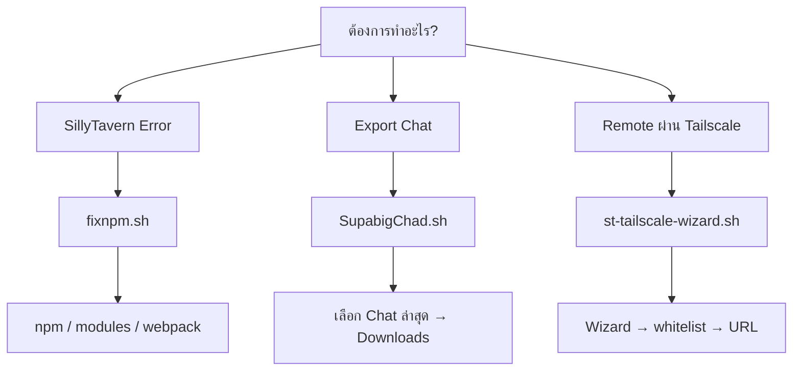

# my-command

<p align="center">
  <b>รวม Script / Utility สำหรับ SillyTavern, Termux และ Tailscale</b>
  <br>
  แก้ปัญหา • จัดการไฟล์ • ตั้งค่า Remote Access • เปิดใช้งานแบบ Wizard
</p>

<p align="center">
  <a href="https://github.com/Ze4llaboizeng/my-command">
    
  </a>
  <a href="https://github.com/Ze4llaboizeng/my-command">
    
  </a>
  
  
  
</p>

---

<a id="menu"></a>

## 📚 เมนู

[🚀 Quick Start](#quick-start) ·
[🧭 เลือกเครื่องมือ](#choose-tool) ·
[🛠 เครื่องมือทั้งหมด](#tools) ·
[🌐 Tailscale Wizard](#tailscale) ·
[⚠️ ก่อนใช้งาน](#warning)

> Repository นี้เป็นชุด Utility ส่วนตัวสำหรับช่วยจัดการและแก้ปัญหาที่พบบ่อยเวลาใช้งาน **SillyTavern** โดยเฉพาะบน **Termux** รวมถึงการตั้งค่าเข้าถึง SillyTavern ผ่าน **Tailscale**

---

<a id="choose-tool"></a>

##  มีปัญหาอะไร? เลือกตรงนี้

<details open>
<summary><b>🔴 SillyTavern เปิดไม่ได้ / npm พัง / module หาย</b></summary>

ใช้:

### [`fixnpm.sh`](./fixnpm.sh)

เหมาะกับอาการ:

* `ERR_MODULE_NOT_FOUND`
* `npm: command not found`
* npm path มีปัญหา
* `node_modules` หายหรือไม่สมบูรณ์
* Webpack compilation/cache error
* `Cannot read properties of undefined`

```bash
bash fixnpm.sh
```

[](./fixnpm.sh)

</details>

<details>
<summary><b>📦 อยากเอา Chat ล่าสุดของ SillyTavern ออกมาไว้ใน Downloads</b></summary>

ใช้:

### [`SupabigChad.sh`](./SupabigChad.sh)

Script จะค้นหา Character/Chat folder ที่มี `.jsonl` แล้วให้เลือกผ่านเมนู จากนั้นนำไฟล์ล่าสุดออกไปไว้ที่:

```text
~/storage/downloads/ST-chat-export/
```

รันด้วย:

```bash
bash SupabigChad.sh
```

> ⚠️ **สำคัญ:** Script นี้ใช้ `mv` ไม่ใช่ `cp`
> หมายความว่าไฟล์ chat ล่าสุดจะถูก **ย้ายออกจากโฟลเดอร์เดิม** ไปที่ Downloads

[](./SupabigChad.sh)

</details>

<details>
<summary><b>🌐 อยากเปิด SillyTavern จากมือถือ / Tablet / PC เครื่องอื่นผ่าน Tailscale</b></summary>

ใช้:

### [`st-tailscale-wizard.sh`](./st-tailscale-wizard.sh)

เป็น Interactive Wizard สำหรับตั้งค่า SillyTavern + Tailscale

รองรับ:

* Android / Termux
* Windows / Git Bash
* Windows / WSL
* Linux
* macOS

เริ่ม Wizard:

```bash
bash st-tailscale-wizard.sh
```

หรือระบุโฟลเดอร์ SillyTavern:

```bash
bash st-tailscale-wizard.sh --dir "$HOME/SillyTavern" wizard
```

[](./st-tailscale-wizard.sh)

</details>

---

<a id="quick-start"></a>

## 🚀 Quick Start

### วิธีแนะนำ: Clone ทั้ง Repository

```bash
git clone https://github.com/Ze4llaboizeng/my-command.git
cd my-command
```

ให้สิทธิ์ execute กับ Bash scripts:

```bash
chmod +x fixnpm.sh SupabigChad.sh st-tailscale-wizard.sh
```

จากนั้นเลือก Script ที่ต้องการ:

```bash
./fixnpm.sh
```

หรือ

```bash
./SupabigChad.sh
```

หรือ

```bash
./st-tailscale-wizard.sh
```

---

### 📥 โหลดเฉพาะ Script

<details>
<summary><b>โหลด fixnpm.sh</b></summary>

```bash
curl -fsSLO https://raw.githubusercontent.com/Ze4llaboizeng/my-command/main/fixnpm.sh
chmod +x fixnpm.sh
./fixnpm.sh
```

</details>

<details>
<summary><b>โหลด SupabigChad.sh</b></summary>

```bash
curl -fsSLO https://raw.githubusercontent.com/Ze4llaboizeng/my-command/main/SupabigChad.sh
chmod +x SupabigChad.sh
./SupabigChad.sh
```

</details>

<details>
<summary><b>โหลด st-tailscale-wizard.sh</b></summary>

```bash
curl -fsSLO https://raw.githubusercontent.com/Ze4llaboizeng/my-command/main/st-tailscale-wizard.sh
chmod +x st-tailscale-wizard.sh
./st-tailscale-wizard.sh
```

</details>

---

<a id="tools"></a>

# 🛠 เครื่องมือใน Repo

| Script                                               | ใช้ทำอะไร                                     | Platform                               |
| ---------------------------------------------------- | --------------------------------------------- | -------------------------------------- |
| [`fixnpm.sh`](./fixnpm.sh)                           | ตรวจและแก้ npm, `node_modules`, Webpack cache | Termux                                 |
| [`SupabigChad.sh`](./SupabigChad.sh)                 | เลือกและย้าย Chat `.jsonl` ล่าสุดไป Downloads | Termux                                 |
| [`st-tailscale-wizard.sh`](./st-tailscale-wizard.sh) | ตั้งค่า SillyTavern ให้ใช้งานผ่าน Tailscale   | Termux / Windows / WSL / Linux / macOS |
| [`StartWithTailscale.bat`](./StartWithTailscale.bat) | เมนู Tailscale สำหรับ Windows CMD             | Windows                                |

---

## 🔧 `fixnpm.sh`

Interactive Fix Script สำหรับ SillyTavern บน Termux

เมื่อเปิด Script จะมีเมนูประมาณนี้:

```text
=======================================
     SillyTavern - Fix Script
=======================================

เลือกปัญหาที่พบ:

[1] ERR_MODULE_NOT_FOUND
[2] npm มีปัญหา / npm path not found
[3] Error webpack compilation error
[0] ออก
```

### สิ่งที่ Script ตรวจสอบ

* npm ใช้งานได้หรือไม่
* มี `~/SillyTavern/node_modules` หรือไม่
* มี `node_modules/.bin` ครบหรือไม่

### ถ้า npm พัง

Script จะพยายามติดตั้ง Yarn:

```bash
pkg install yarn -y
```

แล้วติดตั้ง npm ผ่าน Yarn:

```bash
yarn global add npm
```

### ถ้า `node_modules` มีปัญหา

จะลบของเดิม:

```bash
rm -rf ~/SillyTavern/node_modules
```

แล้วติดตั้ง dependencies ใหม่:

```bash
npm install
```

### ถ้า Webpack cache พัง

จะลบ:

```text
~/SillyTavern/data/_webpack
```

หลังแก้เสร็จ Script จะพยายามเปิด SillyTavern ด้วย:

```bash
./start.sh
```

<details>
<summary><b>⚠️ Script นี้มีการแก้ไขอะไรบ้าง?</b></summary>

ขึ้นอยู่กับปัญหาที่ตรวจพบ Script อาจ:

* ติดตั้ง `yarn`
* ติดตั้ง npm ใหม่
* ลบ `node_modules`
* รัน `npm install`
* ลบ Webpack cache
* เริ่ม SillyTavern อัตโนมัติ

แนะนำให้ดู Script ก่อนรันถ้าใน installation ของคุณมีการแก้ dependencies แบบ custom

</details>

---

## 📦 `SupabigChad.sh`

Utility สำหรับหา Chat `.jsonl` ล่าสุดของ SillyTavern

Script จะค้นหาโฟลเดอร์:

```text
~/SillyTavern/data/*/chats/
```

จากนั้นแสดง Character/Chat folder ที่มีไฟล์ `.jsonl`

ตัวอย่าง:

```text
1) Character-A
   └─ ล่าสุด: 2026-08-12@20h31m.jsonl

2) Character-B
   └─ ล่าสุด: 2026-08-13@01h42m.jsonl

เลือกหมายเลขโฟลเดอร์:
```

เมื่อเลือกแล้ว ไฟล์ล่าสุดจะถูกย้ายไป:

```text
~/storage/downloads/ST-chat-export/
```

ชื่อไฟล์ปลายทางจะมีชื่อ folder นำหน้า เพื่อช่วยลดปัญหาชื่อชนกัน:

```text
Character-A__2026-08-12@20h31m.jsonl
```

### สำหรับ Termux

ถ้ายังไม่เคยอนุญาต Storage ให้รันก่อน:

```bash
termux-setup-storage
```

<details>
<summary><b>⚠️ ทำไมต้องระวัง Script นี้?</b></summary>

คำสั่งที่ Script ใช้คือ:

```bash
mv "$latest" "$destination"
```

ดังนั้นมันคือการ **ย้ายไฟล์** ไม่ใช่ Backup แบบ copy

ถ้าต้องการให้ไฟล์ต้นฉบับยังอยู่ใน SillyTavern ควรเปลี่ยนจาก:

```bash
mv
```

เป็น:

```bash
cp
```

ก่อนใช้งาน

</details>

---

<a id="tailscale"></a>

# 🌐 SillyTavern + Tailscale Wizard

ไฟล์:

```text
st-tailscale-wizard.sh
```

Version ใน Script:

```text
3.2.0
```

Wizard นี้ใช้ช่วยตั้งค่า `config.yaml` ของ SillyTavern เพื่อให้เครื่องอื่นใน Tailscale Tailnet เข้ามาใช้งานได้ โดยไม่ต้องเปิด Port Forwarding บน Router

---

## 🖥️ Platform ที่รองรับ

| Platform           | รองรับ |
| ------------------ | :----: |
| Android / Termux   |    ✅   |
| Windows / Git Bash |    ✅   |
| Windows / WSL      |    ✅   |
| Linux              |    ✅   |
| macOS              |    ✅   |

---

## 🎮 Interactive Wizard

เริ่มด้วย:

```bash
bash st-tailscale-wizard.sh
```

Wizard จะพาไปทีละขั้น:

```text
Host
  ↓
เลือกประเภทการตั้งค่า
  ↓
เลือก Client
  ↓
ใส่ Tailscale IP
  ↓
ตรวจสอบค่าก่อนแก้ไฟล์
  ↓
พิมพ์ APPLY
  ↓
Backup config.yaml
  ↓
บันทึก config ใหม่
  ↓
แสดง URL สำหรับเข้า SillyTavern
```

### Wizard มี 3 โหมดหลัก

<details open>
<summary><b>🔒 1. ตั้งค่าใหม่แบบปลอดภัย</b></summary>

Whitelist จะถูกสร้างใหม่ โดยอนุญาต:

```text
::1
127.0.0.1
CLIENT_TAILSCALE_IP
```

เหมาะกับคนที่อยากระบุว่า **เครื่องไหนเข้า SillyTavern ได้บ้าง**

</details>

<details>
<summary><b>➕ 2. เพิ่ม Client</b></summary>

เก็บ whitelist เดิมไว้ แล้วเพิ่ม Tailscale IP ของเครื่องใหม่เข้าไป

เหมาะกับกรณี:

```text
มีมือถืออยู่แล้ว
+
อยากเพิ่ม iPad
+
ไม่อยากลบค่าของเดิม
```

</details>

<details>
<summary><b>🌍 3. อนุญาตทุกเครื่องใน Tailnet</b></summary>

เพิ่ม network:

```text
100.64.0.0/10
```

ทำให้อุปกรณ์ใน Tailnet สามารถเข้าถึงได้กว้างขึ้น

> ⚠️ ใช้เฉพาะ Tailnet ที่คุณไว้ใจสมาชิกและอุปกรณ์ทั้งหมด

</details>

---

## 🔐 มี Confirmation ก่อนแก้ Config

Wizard จะยัง **ไม่แก้ `config.yaml` ทันที**

ก่อนบันทึกต้องพิมพ์:

```text
APPLY
```

ถ้าไม่พิมพ์ตรงตามนี้ ระบบจะยกเลิกโดยไม่แก้ไฟล์

และก่อนแก้ config จะสร้าง Backup ไว้ให้ก่อน

---

## ↩️ Restore Config

ถ้าต้องการย้อนกลับไป Backup ล่าสุด:

```bash
bash st-tailscale-wizard.sh restore
```

---

## 📊 ดูสถานะ

ดู config และ URL โดยไม่เข้า Wizard:

```bash
bash st-tailscale-wizard.sh status
```

---

## ▶️ Start SillyTavern

```bash
bash st-tailscale-wizard.sh start
```

---

## 📂 ระบุ Path ของ SillyTavern

### Termux / Linux / macOS

```bash
bash st-tailscale-wizard.sh \
  --dir "$HOME/SillyTavern" \
  wizard
```

### WSL

```bash
bash st-tailscale-wizard.sh \
  --dir "/mnt/d/Runbot/SillyTavern" \
  wizard
```

### Git Bash

แนะนำใช้ path แบบ Git Bash:

```bash
bash st-tailscale-wizard.sh \
  --dir "/d/Runbot/SillyTavern" \
  wizard
```

---

## ⚙️ Command Reference

```text
wizard
status
start
restore
help
```

### Options

```text
--dir PATH
--inline
--window
--install
--no-install
--no-color
-V, --version
-h, --help
```

ตัวอย่าง:

```bash
# เปิด Wizard
bash st-tailscale-wizard.sh wizard

# ระบุ ST directory
bash st-tailscale-wizard.sh --dir "$HOME/SillyTavern" wizard

# ดูสถานะ
bash st-tailscale-wizard.sh --dir "$HOME/SillyTavern" status

# Start โดยไม่บังคับ npm install
bash st-tailscale-wizard.sh --no-install start

# ดู Version
bash st-tailscale-wizard.sh --version
```

---

## 🌐 URL สำหรับเครื่อง Client

เมื่อ Host เชื่อมต่อ Tailscale และ Script อ่าน IP ได้สำเร็จ จะได้ URL รูปแบบ:

```text
http://100.x.x.x:8000
```

จากนั้นเปิด URL นี้จากเครื่อง Client ที่เชื่อมอยู่ใน Tailnet เดียวกัน

> ใช้ `http://` ตาม URL ที่ Wizard แสดง
> ไม่จำเป็นต้องทำ Port Forwarding สำหรับการเชื่อมต่อผ่าน Tailscale

---

## `StartWithTailscale.bat`

Repository มี Windows Batch script อีกตัว:

```text
StartWithTailscale.bat
```

ตัวนี้มีเมนูสำหรับ:

```text
1) ตั้งค่าใหม่แบบปลอดภัย
2) เพิ่มเครื่อง Client
3) อนุญาตทุกเครื่องใน Tailnet
4) เปิด SillyTavern
5) Restore config
```

<details>
<summary><b>⚠️ สถานะของ StartWithTailscale.bat</b></summary>

`StartWithTailscale.bat` ต้องใช้ไฟล์:

```text
st-tailscale-config.ps1
```

ร่วมด้วย แต่ไฟล์ดังกล่าวยังไม่อยู่ใน root ของ Repository ปัจจุบัน

ดังนั้นถ้าจะใช้งานจาก Repo นี้โดยตรง ตอนนี้แนะนำ:

```text
st-tailscale-wizard.sh
```

เป็นตัวหลักก่อน

</details>

---

<a id="warning"></a>

# ⚠️ ก่อนใช้งาน

Scripts ใน Repository นี้มีบางคำสั่งที่แก้ไขข้อมูลจริง เช่น:

```bash
rm -rf
mv
npm install
```

ดังนั้นก่อนรันควรทราบว่า:

* `fixnpm.sh` สามารถลบและสร้าง `node_modules` ใหม่ได้
* `fixnpm.sh` สามารถลบ Webpack cache ได้
* `SupabigChad.sh` **ย้าย** Chat `.jsonl` ออกจากตำแหน่งเดิม
* Tailscale Wizard แก้ `config.yaml` แต่มีขั้นยืนยันและ Backup ก่อนบันทึก
* โหมด `100.64.0.0/10` อนุญาตการเข้าถึงกว้างกว่า whitelist ราย IP

---

## 🧪 ดู Script ก่อนรัน

GitHub:

* [`fixnpm.sh`](./fixnpm.sh)
* [`SupabigChad.sh`](./SupabigChad.sh)
* [`st-tailscale-wizard.sh`](./st-tailscale-wizard.sh)
* [`StartWithTailscale.bat`](./StartWithTailscale.bat)

หรือใน Terminal:

```bash
less fixnpm.sh
```

```bash
less st-tailscale-wizard.sh
```

---

## 🗺️ เลือก Script แบบเร็ว



---

## 🤝 Contributing

ถ้าเจอ Bug หรือมี Error แบบใหม่ที่ควรเพิ่มเข้า Script:

1. เปิด [Issue](../../issues)
2. ใส่ข้อความ Error
3. บอก Platform ที่ใช้
4. แนบขั้นตอนที่ทำให้เกิดปัญหา
5. อย่าแนบ Token, API Key หรือข้อมูลส่วนตัวลง Issue

Pull Request ก็ยินดีเช่นกัน

---

<p align="center">
  <b>Made for fixing SillyTavern problems without manually typing the same commands for the 47th time.</b>
</p>

<p align="center">
  <a href="#menu">⬆️ กลับขึ้นด้านบน</a>
</p>
